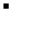

# pattern_detection_grayscale
pattern_detection_grayscale 
first of all I apologize for my english. (; 
Here i create some codes to be published about pattern detection in image. 
for the beginning i write a code to compare two image. one as input image and the other as pattern image which we are looking for it in the input image. 
The distinctive feature of this code is that in this code **similarity factor** is calculated and the **location of detected pattern in the image is boxed on image as red rectangle box**. 
note 1: I create the pattern and input image in main.py manualy but you can import it using cv2.imread(...)
## run: main.py

## application:
detect pattern in any desired shape in any desired input image shape

## adjustable parameters:
the most important part of this code is pattern_similarity function.
pattern_similarity(in_img,pattern,min_similarity:float=0.8) => it has three input parameters which the last one is optional and it is by defualt equal to 80% similarity to detect pattern in image
## example:
here is some examples: 
### example 1:
original image is: 
<kbd><kbd/>
